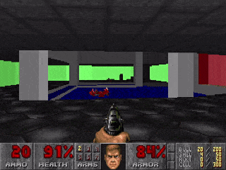

A WIP to put Doom 1993 on the IPU.

```bash
# Install dependencies
sudo apt update 
sudo apt-get install -y libsdl2-dev libsdl2-image-dev libsdl2-mixer-dev libsdl2-net-dev libpng-dev g++-7
# Build binary
make
# Download shareware resource pack
wget https://distro.ibiblio.org/slitaz/sources/packages/d/doom1.wad
# Run
./build/doom -iwad doom1.wad -width 320 -nosound 
```


Vanilla Doom runs on the CPU, have started offloading subsystems to IPU Tile 0.
Activity Log:

- [x] Create IPU hooks for key methods like G_Ticker, G_Responder so IPU can step game time and respond to keypresses in real time. (Also setviewsize etc)

- [x] Implement IPU memory allocator for level state, i.e., anything with lifetime PU_LEVEL

- [x] IPU interacts with host to load and unpack all level geometry from disk whenever a level is loaded

- [x] Implement all methods used by the automap (vector rendering, sprite rendering, AM event responder). Automap is now disabled on CPU, renders entirely on IPU.
  

- [x] Implement BinarySpacePartion search (stackless recursion version for IPU), solidseg occlusion and floor/ceiling clipping to get (untextured) rendering of vertical walls running on the IPU. CPU still renders everything else.

Immediate next steps:
- [ ] Port visplane system to get IPU rendering floors and ceilings?
- [ ] Textures are too large to fit on a singe tile, so devise a mechanism for tiles to cooperate on texturing wall.

Longer term next steps:

- [ ] Render other things in the level
- [ ] Move beyond just the rendering?


  ...

- [ ] Profit

