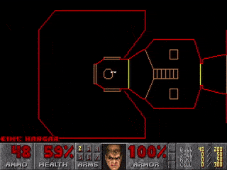
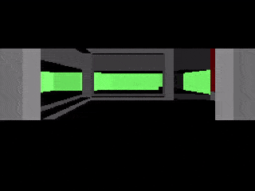
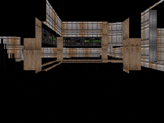
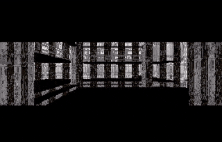
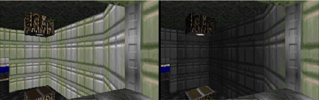
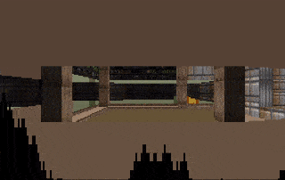
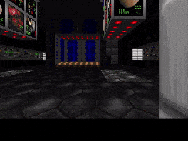

A WIP to run Doom 1993 into the SRAM (~L1 cache) of the Graphcore MkII IPU (an AI accelerator chip which was definitely not designed to play video games). This is a hobby project, not a Graphcore product.

## Build and Run
I use Ubuntu20 and Poplar SDK 3.3, but recent versions of either should be fine.
Due to the use of mutable global state and a custom exchange compiler, IPUDOOM requires a real IPU and will not run on the IPUModel (CPU simulating an IPU).
Make sure you have X11 fowarding over SSH working (use `ssh -X <address>` and have a local X server, e.g. Quartz on Mac, Xming on Windows). If your connection is fast enough, you should be able to get > 30 fps.

```bash
# Install dependencies
sudo apt update 
sudo apt-get install -y libsdl2-dev libsdl2-image-dev libsdl2-mixer-dev libsdl2-net-dev libpng-dev g++-7

# Activate your poplar SDK
source ~/path/to/poplar/build_release/activate.sh

# Clone and build
git clone git@github.com:jndean/IPUDOOM.git
cd IPUDOOM
make -j4

# Download the doom shareware resource pack (contains the free levels)
wget https://distro.ibiblio.org/slitaz/sources/packages/d/doom1.wad

# To play the game, run. Press any key to bring up the menu.
./build/doom -iwad doom1.wad -width 320 -nosound -nomouse
```


## Progress Log:
Started with Chocolate Doom running on the CPU, began offloading subsystems to the IPU (just Tile 0 at first): 

- [x] Create IPU hooks for key methods like G_Ticker and G_Responder so IPU can step game time and respond to keypresses in real time. IPU uses callbacks on the host to load and unpack all level geometry from disk whenever the player starts a new level.

- [x] Implement an IPU-specific memory allocator with seperate memory pools for different lifetimes: static lifetime, level lifetime, frame lifetime. Makes fragmanetation easy to avoid => reduces SRAM footprint.

- [x] Implement all methods used by the automap (vector rendering, sprite rendering, AM event responder). Automap is now disabled on CPU, renders entirely on IPU.



- [x] Implement BinarySpacePartion search (stackless recursion version for IPU), solidseg occlusion and floor/ceiling clipping to get (untextured) rendering of vertical walls running on a sinlge IPU tile.



- [x] Split rendering across 32 render tiles. Reformat textures into a big buffer that can be striped over other dedicated texture tiles, and accessed by the render tiles using JIT-patched exchange programs to enable fetches based on dynamic indices. So now the IPU can texture walls in real time.

 

- [x] Implement lighting model (add shadows to walls): the texture tiles translate the colours during texture column fetch requests to save SRAM on the render tiles.



- [x] Port the visplane system to the render tiles, so IPU can render floors and ceilings, (untextured for now - instead coloured to show the visplane subdivision). Also implement skybox.



- [x] Extend the JIT-patching texture exchange to support span textures and zlighting, so IPU can texture and shade floors + ceilings. (The flashing in the gif below comes from gunfire, though enemies and weapons are not yet rendered).



Immediate next steps:
- [ ] Implement temporary(?) system to notify IPU of map state changes, so that doors open and close properly. Perhaps the same could work for enemys and projectiles.
- [ ] Implement vissprite system and masked col rendering to add objects / enemies to levels. 
- [ ] Set up the animation indirection tables so that animated texures work

Longer term next steps:

- [ ] Render HUD (probably easy using dedicated HUD-rendering tiles)
- [ ] Move beyond just the rendering?

  ...

- [ ] Profit?

